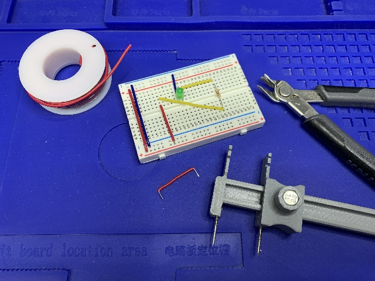

Maker Media GmbH

***

# Biegelehre für Breadboard & Co.: Drahtbrücken und Bauteilbeinchen präzise abwinkeln

#### Breadboards kunstvoll aufzubauen ist nicht nur eine Zier: Auch die Übersichtlichkeit und Signalqualität wird verbessert, dies hilft im Fehlerfall und auch der Nachbau wird einfacher. Gleichfalls werden Drahtbrücken und Bauteilbeinchen auf Lochrasterplatinen mit unserem 3D-gedruckten Werkzeug schön gerade und ansehnlich.

 

Den vollständigen Artikel gibt es in der [Elektrotechnik Sonderheft Make 7/22 ab Seite 23](https://www.heise.de/select/make/2022/7/seite-23). 

Im FreeCAD die Dateien des Autors, im Blender-Verzeichnis die Werkzeuge im Blenderformat mit Spitzen aus 2mm Stahldraht.

Schicken Sie uns gerne Bilder Ihrer Aufbauten an info@make-magazin.de!

